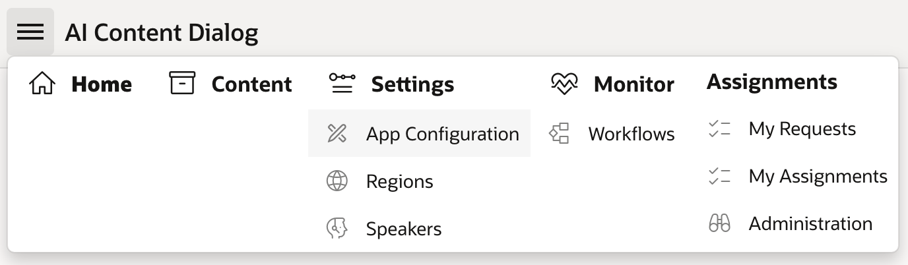
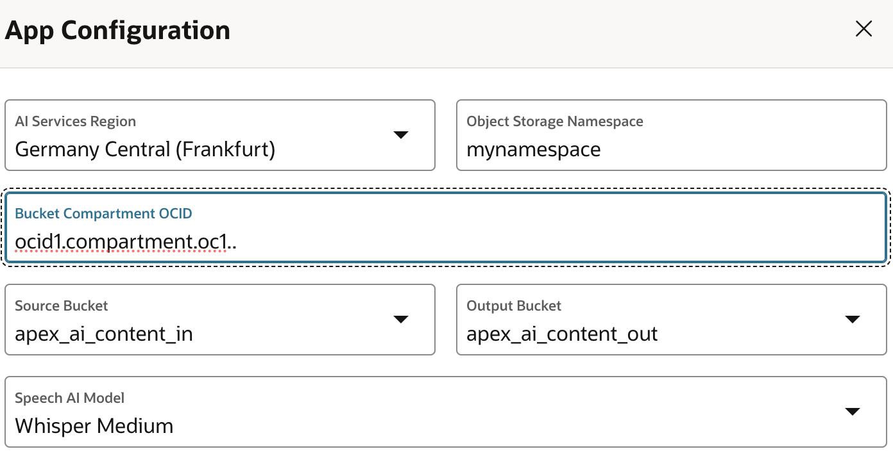

# MemVault – Process meetings with OCI Speech and find insights with Autonomous database 26ai and GenAI

## Get Started

Learn how to load and process meetings and find insights with Autonomous database 26ai and GenAI.

You can obtain useful and actionable information from meeting recordings. With this solution playbook you learn how to use Oracle technologies to ask questions about your meetings, summarize meetings or just simply take notes.

---

## Architecture

To deploy this architecture, you’ll need:
- OCI Speech
- An embedding model
- Oracle Database 26ai
- APEX
- OCI Generative AI

This architecture features the primary components listed below :

### Oracle Cloud Infrastructure Speech

Oracle Cloud Infrastructure (OCI) Speech is one of several cloud-native AI services. You can use the Speech service to convert audio files to readable text stored in JSON format.

Speech uses automatic speech recognition (ASR) technology to provide grammatically correct transcriptions of video and audio files. It handles low-fidelity audio and challenging recordings like meetings or call center calls. Using Speech, you can turn files stored in OCI Object Storage or a data asset into accurate, normalized, timestamped, and profanity-filtered text.

### AI Vector Search on Oracle 26ai

Oracle Database 26ai provides **AI vector search** to query data based on semantics rather than keywords. 

Vectors (or embeddings) are multidimensional representations of documents, images, videos, sound, etc. With vector encoding, you can look for similarities using mathematical calculations. Oracle 23ai enables combining similarity searches with business data using simple SQL, enhancing LLM responses with contextual relevance.

### Generative AI and Large Language Models

Oracle Cloud Infrastructure Generative AI is a fully managed service offering customizable large language models (LLMs). Use cases include:
- Text generation
- Summarization
- Semantic search

You can use pretrained models or fine-tune custom ones on dedicated AI clusters.

In this architecture, LLMs are used to generate:
- User manuals for selected project types
- Descriptions of products sent to the shopping cart

### Oracle APEX Application Development

Oracle APEX is a low-code platform for building secure and scalable enterprise apps that run wherever Oracle Database is installed.

It includes:
- UI themes
- Navigation controls
- Form handlers
- Flexible reports

---

## Before You Begin

We recommend having background knowledge of:
- Oracle Database
- APEX
- REST services

However, simply following the steps in this playbook will deploy the app in your tenant.

---

## About Required Services and Roles

This solution requires the following services:

- Oracle Cloud Infrastructure Speech
- Oracle Cloud Infrastructure Language
- Oracle Cloud Infrastructure Generative AI

### Roles Required:

| Service Name                        | Role                             | Required to...                                           |
|------------------------------------|----------------------------------|----------------------------------------------------------|
| Oracle Cloud Infrastructure Speech | `manage ai-service-speech-family` | Create and manage transcription jobs                     |
| Oracle Cloud Infrastructure Language | `manage ai-service-language-family` | Manage language projects and sentiments                  |
| Oracle Cloud Infrastructure Generative AI | `manage generative-ai-family`     | Manage AI models, generate text, and perform summarization |

---

## Deploy

Download the code from GitHub.  
The sample code is available on GitHub.

1. Clone or download the repository  
2. Follow the instructions in the `README.md`  
3. Follow the steps in this solution playbook to configure the app

---

## Prepare Your Environment

### Prepare Your User

OCI API keys are used for secure authentication when accessing OCI resources via REST APIs. You’ll need a public/private key pair.

To generate API keys in the OCI console:

1. Log in to your OCI tenant.
2. View the user's details:
   - For yourself: Open the Profile menu → **My profile**
   - For others: Go to **Identity and Security** → **Users**
3. In **Resources**, click **API Keys**
4. Click **Add API Key** → **Generate API Key Pair**
5. Download the private key and save it to your `.oci` directory
6. Copy the **Configuration File Preview** into your `~/.oci/config`

### Select a Compartment

1. Navigate to **Identity** → **Compartments**
2. Locate your compartment and note the **OCID**

### Create a Bucket to Store Meetings

1. Go to **Storage** → **Object Storage and Archive Storage**
2. Click **Buckets** → **Create Bucket**
3. Name the bucket `AI_Meetings`
4. Click **Create**

---

## Configure Project in APEX

Configure Workspace Credentials

The app uses a common OCI Credential for OCI Generative AI, Speech, & Object Storage services. The credential static ID that is referenced by the App setting is oci_credential by the App Substitution Strings

- G_APP_OCI_CREDENTIAL
- G_APP_OCI_GENAI_CREDENTIAL
- G_APP_OCI_OBJSTOR_CREDENTIAL
- G_APP_OCI_SPEECH_CREDENTIAL

For deployments that require the use of separate credentials per service, follow the prepare your user section and then create a new APEX Web Credential per new credential referencing the [Creating Web Credentials](https://docs.oracle.com/en/database/oracle/apex/24.2/htmdb/creating-web-credentials.html#GUID-B70F8886-FE36-4AA7-BB39-9836D5775BEE) documentation.

Following the [Creating Web Credentials](https://docs.oracle.com/en/database/oracle/apex/24.2/htmdb/creating-web-credentials.html#GUID-B70F8886-FE36-4AA7-BB39-9836D5775BEE) documentation, edit the OCI_CREDENTIAL credential record for the OCI Native Authentication authentication type. This credential has the static Identifier of oci_credential that is referenced by all of the app settings.

**Configuring the App**

The App uses two sets of configuration settings: app definition substitution strings & tenancy details.

**Configuring the App Configuration Settings**

The App definition leverages a common Web Credential and normally does not need to be updated. For deployments that require the use of separate credentials, the App Configuration settings should reflect the use of the credentials.

Follow the [Editing the Application Definition](https://docs.oracle.com/en/database/oracle/apex/24.2/htmdb/editing-application-attributes.html#GUID-8B6DF456-41CC-40E3-877E-A0038677AADE) to update the value of the substitution strings that are defined by the App.

**Configuring the App Tenancy Details**

Tenancy details are managed in an App via the App Configuration menu item:

1. Log into the App
2. Use the navigation menu and select App Configuration under Settings 
3. Enter the details for the Tenancy and Region for the AI Services:
   1. AI Services Region
   2. Object Storage Namespace
   3. Bucket Compartment OCID
   4. Source Bucket
   5. Output Bucket
   6. Speech AI Model
4. Click Apply 

## Explore More

To learn more about <topics>, see the following resources:

- [Well-Architected Framework for Oracle Cloud Infrastructure](https://docs.oracle.com/en/solutions/oci-best-practices/index.html)

## Security

Oracle takes security seriously and has a dedicated response team for [reporting security vulnerabilities](./SECURITY.md) and to answer any security and vulnerability related questions.

## Contributing

We welcome all contributions to this sample and have a [contribution guide](./CONTRIBUTING.md) for you to follow if you'd like to contribute.

## Distribution
Developers choosing to distribute a binary implementation of this project are responsible for obtaining and providing all required licenses and copyright notices for the third-party code used in order to ensure compliance with their respective open source licenses.

## Help

If you need help with this sample, please log an issue within this repository and the code owners will help out where we can.

## License

Copyright (c) 2025 Oracle and/or its affiliates. 

Licensed under the Universal Permissive License v 1.0 as shown at 
https://oss.oracle.com/licenses/upl.
